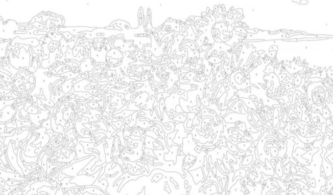

---
tags:
  - Cours 3
  - Vendredi 6 septembre
---

# Bootstrap 1/3


Bootstrap est un cadriciel (*framework*) front-end qui offre une structure de styles et de mise en page permettant aux développeurs de ne pas réinventer la roue à chaque projet. Il fournit une [collection de composantes](https://getbootstrap.com/docs/5.3/examples/cheatsheet/) (*components*) ainsi que plusieurs classes CSS facilitant la création de sites Web réactifs (*responsive*).

## Annonce

[Tutorat](https://teams.microsoft.com/l/message/19:0df14bbe83b542679a319fb4fa0dcea8@thread.tacv2/1725560842882?tenantId=ffa995c7-10de-4ec8-95db-28ed0576455d&groupId=924057af-2255-4c2a-8ce7-f0a1809ad4a4&parentMessageId=1725560842882&teamName=TIM%20-%20Programme%20TIM&channelName=General&createdTime=1725560842882)

## Installation

Pour [installer Bootstrap](https://getbootstrap.com/docs/5.3/getting-started/download), vous n'avez qu'à inclure ces deux balises dans votre HTML.

Nous utilisons la [version 5.3.3](https://getbootstrap.com/docs/versions/) du framework.

```html
<link href="https://cdn.jsdelivr.net/npm/bootstrap@5.3.3/dist/css/bootstrap.min.css" rel="stylesheet" integrity="sha384-QWTKZyjpPEjISv5WaRU9OFeRpok6YctnYmDr5pNlyT2bRjXh0JMhjY6hW+ALEwIH" crossorigin="anonymous">
```

!!! question "integrity & crossorigin 🤔"
    L’attribut `integrity` est utilisé pour des raisons de sécurité. C'est le hash (sommes de contrôle cryptographiques) du fichier original.
    L’attribut, `crossorigin` pour sa part, indique que la requête à cdn.jsdelivr.net doit être faite sans envoyer de témoins (cookies), identifiants ou autres informations de l’utilisateur.

Voici un aperçu du HTML de départ.

```html
<!doctype html>
<html lang="fr">
  <head>
    <meta charset="utf-8">
    <meta name="viewport" content="width=device-width, initial-scale=1">
    <title>Bootstrap</title>
    <link href="https://cdn.jsdelivr.net/npm/bootstrap@5.3.3/dist/css/bootstrap.min.css" rel="stylesheet" integrity="sha384-QWTKZyjpPEjISv5WaRU9OFeRpok6YctnYmDr5pNlyT2bRjXh0JMhjY6hW+ALEwIH" crossorigin="anonymous">
  </head>
  <body>
    <!-- Code de la page ici -->

    <script src="https://cdn.jsdelivr.net/npm/bootstrap@5.3.3/dist/js/bootstrap.bundle.min.js" integrity="sha384-YvpcrYf0tY3lHB60NNkmXc5s9fDVZLESaAA55NDzOxhy9GkcIdslK1eN7N6jIeHz" crossorigin="anonymous"></script>
  </body>
</html>
```

## Couleurs

<div class="grid" markdown>
  <div markdown>
  Les [couleurs bootstrap](https://getbootstrap.com/docs/5.3/customize/color/) sont représentées par des **identifiants** auxquels sont assignées des couleurs prédéfinies.

  Voici la liste des **identifiants** associés à leur couleur respective.
  </div>

  <iframe class="aspect-1-1" height="300" style="width: 100%;" scrolling="no" title="Couleur - Primary" src="https://codepen.io/tim-momo/embed/poXJXaO?default-tab=result&theme-id=50173" frameborder="no" loading="lazy" allowtransparency="true" allowfullscreen="true">
    See the Pen <a href="https://codepen.io/tim-momo/pen/poXJXaO">
    Couleur - Primary</a> by TIM Montmorency (<a href="https://codepen.io/tim-momo">@tim-momo</a>)
    on <a href="https://codepen.io">CodePen</a>.
  </iframe>
</div>

### Variables

Ces **identifiants** (primary, secondary, light, dark, etc.) sont utilisés dans des variables CSS, ce qui permet de personnaliser facilement les couleurs de Bootstrap.

Par exemple, si on souhaite changer la couleur associée à `primary`, on peut tout simplement réécrire les variables concernées :

```css
:root {
  --bs-primary: #6610f2;
  --bs-primary-rgb: 102, 16, 242;
}
```

<iframe class="aspect-4-1" height="300" style="width: 100%;" scrolling="no" title="Couleurs" src="https://codepen.io/tim-momo/embed/WNqvqKJ?default-tab=result&theme-id=50173" frameborder="no" loading="lazy" allowtransparency="true" allowfullscreen="true">
  See the Pen <a href="https://codepen.io/tim-momo/pen/WNqvqKJ">
  Couleurs</a> by TIM Montmorency (<a href="https://codepen.io/tim-momo">@tim-momo</a>)
  on <a href="https://codepen.io">CodePen</a>.
</iframe>

!!! info "Préfix des variables"
    Afin de ne pas interférer avec d'autres variables potentielles d'un projet, Bootstrap permet d'ajouter un préfix aux variables. Par défaut, le préfix est `bs-`.

Pour connaitre le nom des variables Bootstrap, il suffit de consulter la [documentation officielle](https://getbootstrap.com/docs/5.3/customize/css-variables/) ou encore, consulter l'inspecteur du navigateur.

{data-zoom-image}

### Classes

Bootstrap fournit un vaste ensemble de classes CSS prêtes à l’emploi.

Par exemple, pour appliquer différents styles associés à la couleurs `danger`, voici quelques classes CSS disponibles.

```scss
.text-danger           // Couleur de texte
.bg-danger             // Couleur de fond
.border-danger         // Couleur de bordure
.btn-danger            // Couleur de bouton
.btn-outline-danger    // Couleur de bouton
.alert-danger          // Couleur de message
.badge-danger          // Couleur de pastille
.table-danger          // Couleur de tableau
.link-danger           // Couleur de lien
```

Dans l'exemple ci-dessous, on voit l'effet des classes CSS Bootstrap sur du code HTML.

<iframe class="aspect-3-2" height="300" style="width: 100%;" scrolling="no" title="Couleur - Danger" src="https://codepen.io/tim-momo/embed/MWMwYeY?default-tab=html%2Cresult&editable=true&theme-id=50173" frameborder="no" loading="lazy" allowtransparency="true" allowfullscreen="true">
  See the Pen <a href="https://codepen.io/tim-momo/pen/MWMwYeY">
  Couleur - Danger</a> by TIM Montmorency (<a href="https://codepen.io/tim-momo">@tim-momo</a>)
  on <a href="https://codepen.io">CodePen</a>.
</iframe>

!!! example "Exercice rapide"
    Change le nom des classes CSS avec différents identifiants Bootstrap.
    Par exemple, remplace les mentions `danger` par `primary` ou `warning` et observe le résultat.

### Mode sombre (darkmode)


Pour activer le mode sombre, il suffit d’ajouter l'attribut `data-bs-theme="dark"` à l'élément `<html>` ou `<body>` de votre page :

```html
<html data-bs-theme="dark">
```

## Points d'arrêt

{.invert} [^breakpoint]

[^breakpoint]: Illustration breakpoint : https://webandcrafts.com/blog/beginners-guide-to-responsive-web-design

Un point d'arrêt, point de rupture ou en anglais, [breakpoint](https://blog.froont.com/9-basic-principles-of-responsive-web-design/), est une condition où la mise en page du site Web change pour s’adapter à différentes tailles d’écran.

Le breakpoint est une notion importante des « [media queries](https://tim-montmorency.com/timdoc/582-211MO/css/media-queries/) » en CSS.

Voici un exemple traditionnel de gestion de breakpoint :

```scss
.col {
  width: 50%;
}

@media (max-width: 992px) { // 👈 Breakpoint
  .col {
    width: 100%;
  }
}
```

En Bootstrap, plusieurs points de rupture (breakpoints) sont prédéfinis !

Portez une attention particulière à la colonne des suffixes. Nous y reviendrons 😜.

| Point de rupture  | Suffixe de classe | Dimensions | CSS                               |
|-------------------|-------------------|------------|-----------------------------------|
| Extra petit       | `xs`              | `<576px`   | `@media (max-width: 575.98px) {}` |
| Petit             | `sm`              | `≥576px`   | `@media (min-width: 576px) {}`    |
| Moyen             | `md`              | `≥768px`   | `@media (min-width: 768px) {}`    |
| Large             | `lg`              | `≥992px`   | `@media (min-width: 992px) {}`    |
| Extra large       | `xl`              | `≥1200px`  | `@media (min-width: 1200px) {}`   |
| Extra extra large | `xxl`             | `≥1400px`  | `@media (min-width: 1400px) {}`   |

!!! info "Navigateur de breakpoint 😱"
    [Responsively App Downloads](https://responsively.app/download) est un outil intéressant pour visionner en un coup d'oeil le site sur plusiers appareils.

## Conteneurs

Un conteneur Bootstrap c'est simplement une classe CSS qu'on assigne à un `<div>` dans le but de définir sa largeur.

```html
<div class="container">
  ...
</div>
```

Les tailles des conteneurs selon les différents points de rupture de la page.

| CSS                     | sm      | md      | lg      | xl      | xxl     |
|-------------------------|---------|---------|---------|---------|---------|
| `.container` :fontawesome-regular-hand-point-left:{ .horizontal-anim .valign-bottom }           | `540px` | `720px` | `960px` | `1140px`| `1320px`|
| `.container-sm`         | `540px` | `720px` | `960px` | `1140px`| `1320px`|
| `.container-md`         | `100%`  | `720px` | `960px` | `1140px`| `1320px`|
| `.container-lg`         | `100%`  | `100%`  | `960px` | `1140px`| `1320px`|
| `.container-xl`         | `100%`  | `100%`  | `100%`  | `1140px`| `1320px`|
| `.container-xxl`        | `100%`  | `100%`  | `100%`  | `100%`  | `1320px`|
| `.container-fluid` :fontawesome-regular-hand-point-left:{ .horizontal-anim .valign-bottom }      | `100%`  | `100%`  | `100%`  | `100%`  | `100%`  |

Démonstration

<iframe class="aspect-16-9" height="300" style="width: 100%;" scrolling="no" title="Container" src="https://codepen.io/tim-momo/embed/YzoXmxE/d9ea04613092a1049bb7433e3331269a?default-tab=result&editable=true&theme-id=50173" frameborder="no" loading="lazy" allowtransparency="true" allowfullscreen="true">
  See the Pen <a href="https://codepen.io/tim-momo/pen/YzoXmxE/d9ea04613092a1049bb7433e3331269a">
  Container</a> by TIM Montmorency (<a href="https://codepen.io/tim-momo">@tim-momo</a>)
  on <a href="https://codepen.io">CodePen</a>.
</iframe>

## Système de grille (grid system)

<iframe class="aspect-4-1" height="300" style="width: 100%;" scrolling="no" title="Grille" src="https://codepen.io/tim-momo/embed/LYKVwKQ?default-tab=&editable=true&theme-id=50173" frameborder="no" loading="lazy" allowtransparency="true" allowfullscreen="true">
  See the Pen <a href="https://codepen.io/tim-momo/pen/LYKVwKQ">
  Grille</a> by TIM Montmorency (<a href="https://codepen.io/tim-momo">@tim-momo</a>)
  on <a href="https://codepen.io">CodePen</a>.
</iframe>

[Documentation officielle](https://getbootstrap.com/docs/5.3/layout/grid/)

Bootstrap vient avec un système de grille à 12 colonnes. Il nous permet d'ajouter facilement des colonnes sans avoir à écrire une seule ligne de CSS. Voici la syntaxe :

```html
<div class="container">
  <div class="row">
    <div class="col">Colonne 1</div>
    <div class="col">Colonne 2</div>
    <div class="col">Colonne 3</div>
    <div class="col">etc.</div>
  </div>
</div>
```

Lorsqu'on veut spécifier une taille de colonne, on doit ajuster la classe CSS `.col` et lui spécifier une proportion sur 12 colonnes. Voici un exemple :

<iframe class="aspect-16-9" height="300" style="width: 100%;" scrolling="no" title="Grille CSS" src="https://codepen.io/tim-momo/embed/wvLKwWv?default-tab=result&editable=true&theme-id=50173" frameborder="no" loading="lazy" allowtransparency="true" allowfullscreen="true">
  See the Pen <a href="https://codepen.io/tim-momo/pen/wvLKwWv">
  Grille CSS</a> by TIM Montmorency (<a href="https://codepen.io/tim-momo">@tim-momo</a>)
  on <a href="https://codepen.io">CodePen</a>.
</iframe>

On peut également utiliser les suffixes de point de rupture. Ainsi nos colonnes deviennent *responsive*!

<iframe class="aspect-16-9" height="300" style="width: 100%;" scrolling="no" title="Grille Tailles" src="https://codepen.io/tim-momo/embed/wvLKwea?default-tab=result&editable=true&theme-id=50173" frameborder="no" loading="lazy" allowtransparency="true" allowfullscreen="true">
  See the Pen <a href="https://codepen.io/tim-momo/pen/wvLKwea">
  Grille Tailles</a> by TIM Montmorency (<a href="https://codepen.io/tim-momo">@tim-momo</a>)
  on <a href="https://codepen.io">CodePen</a>.
</iframe>

Moins fréquent, mais très pratique, la notion d'[offset](https://getbootstrap.com/docs/5.3/layout/columns/#offsetting-columns) permet de d'espacer les colonnes de la gauche.

## Ordre CSS

[Bootstrap, flex et order](https://getbootstrap.com/docs/5.3/utilities/flex/#order)

## Espacement

La gestion des espacements en Bootstrap est beaucoup plus simple qu'il n'y parait. Il suffit de connaitre la syntaxe.

Les classes CSS sont construites de la façon suivante : `{propriété}{côté}-{taille}` et `{propriété}{côté}-{breakpoint}-{taille}`

<div class="grid cards" markdown>

-   **Propriété**

    ---

    `m` = margin<br>
    `p` = padding

-   **Côté**

    ---

    `t` = top<br>
    `b` = bottom<br>
    `s` = left (start)<br>
    `e` = right (end)<br>
    `x` = l'axe des x<br>
    `y` = l'axe des y

-   **Taille**

    ---

    `0` = 0<br>
    `1` = 0.25rem<br>
    `2` - 0.5rem<br>
    `3` - 1rem<br>
    `4` - 1.5rem<br>
    `5` - 3rem<br>
    `auto`

</div>

```css title="Exemples de classes d'espacement"
.m-0     .my-4     .mt-md-5
.p-1     .ps-2     .px-xxl-51
```

<iframe class="aspect-4-1" height="300" style="width: 100%;" scrolling="no" title="Image fluid" src="https://codepen.io/tim-momo/embed/jOjbNdm?default-tab=html%2Cresult&theme-id=50173&editable=true" frameborder="no" loading="lazy" allowtransparency="true" allowfullscreen="true">
  See the Pen <a href="https://codepen.io/tim-momo/pen/jOjbNdm">
  Image fluid</a> by TIM Montmorency (<a href="https://codepen.io/tim-momo">@tim-momo</a>)
  on <a href="https://codepen.io">CodePen</a>.
</iframe>

## Typographie

[Styles de titre](https://getbootstrap.com/docs/5.3/content/typography/)

```html
<p class="h1">h1. Bootstrap heading</p>
<p class="h2">h2. Bootstrap heading</p>
<p class="h3">h3. Bootstrap heading</p>
<p class="h4">h4. Bootstrap heading</p>
<p class="h5">h5. Bootstrap heading</p>
<p class="h6">h6. Bootstrap heading</p>
```

[Styles de titre extra gros](https://getbootstrap.com/docs/5.3/content/typography/#display-headings)

```html
<h1 class="display-1">Display 1</h1>
<h1 class="display-2">Display 2</h1>
<h1 class="display-3">Display 3</h1>
<h1 class="display-4">Display 4</h1>
<h1 class="display-5">Display 5</h1>
<h1 class="display-6">Display 6</h1>
```

[Emphase de paragraph](https://getbootstrap.com/docs/5.3/content/typography/#lead) (plus gros)

```html
<p class="lead">
  This is a lead paragraph. It stands out from regular paragraphs.
</p>
```

[Alignement du texte](https://getbootstrap.com/docs/5.3/utilities/text/#text-alignment)

```css
.text-start
.text-center
.text-end
```

## Exercices

<div class="grid grid-1-2" markdown>
  

  <small>Exercice - JavaScript & Bootstrap</small><br>
  **[Changer le thème du site en JavaScript](exercices/bs-darkmode.md){.stretched-link}**
</div>

<div class="grid grid-1-2" markdown>
  

  <small>Exercice - JavaScript & Bootstrap</small><br>
  **[Peinture à classe](exercices/bs-imagecachee.md){.stretched-link}**
</div>

<div class="grid grid-1-2" markdown>
  

  <small>Exercice - HTML & Bootstrap</small><br>
  **[Casse-grille](exercices/bs-casse-tete.md){.stretched-link}**
</div>

## Devoir 1 formatif - remise 12 septembre minuit

<div class="grid grid-1-2" markdown>
  

  <small>Devoir - HTML & Bootstrap</small><br>
  **[Tarte aux pommes](devoir/bs-devoir1.md){.stretched-link}**
</div>

<!-- ## PS1 - Remise 3 octobre minuit -->
