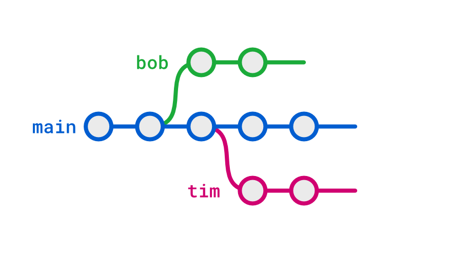
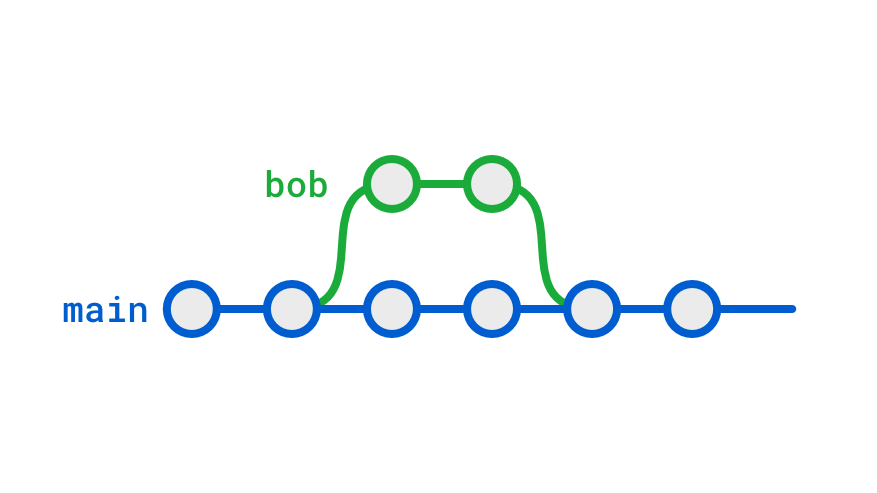
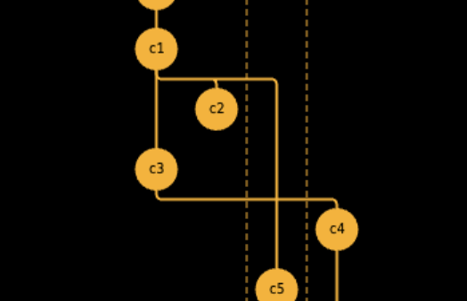

# Git

Git est un outil qui vous protège de vous-même. Il permet en quelque sorte de faire des « checkpoints » ou en français, des points de sauvegarde :material-content-save-outline:, dans un projet.


Ainsi, vous pouvez modifier votre projet l'esprit tranquille, puisqu'il vous permet de revenir en arrière en cas de besoin.

## Répertoire :material-source-repository:

Un répertoire (« repository » ou « repo » en anglais) est le nom donné au dossier :material-folder-open: surveillé par Git. À chaque `commit`, tous les changements effectués à l'intérieur de celui-ci seront enregistrés par Git.

!!! info ".git"

    Lorsqu'un dossier est surveillé par Git, un dossier caché nommé `.git` s'ajoutera à la racine. Il contient les données données de version, de branches et de configuration Git.

## Commit

À tout moment, il est possible de sauvegarder en local (sur son ordinateur) l'avancement d'un projet :material-content-save-outline: avec Git.

On doit dabord choisir quels fichiers ou changements on souhaite sauvegarder. Cette étape est appelée `staging` ou `stage`. Ensuite, on peut faire une sauvegarde acccompagnée d'un petit commentaire[^gitcomment]. Cette étape est appelée `commit` :octicons-git-commit-16:.

[^gitcomment]: [Comment rédiger un bon commit](https://medium.com/@hritik.jaiswal/how-to-write-a-good-commit-message-9d2d533b9052) (en anglais)

<iframe class="aspect-2-1" height="300" style="width: 100%;" scrolling="no" title="Git - Commit" src="https://codepen.io/tim-momo/embed/abgjPBv?default-tab=result&theme-id=50173" frameborder="no" loading="lazy" allowtransparency="true" allowfullscreen="true">
  See the Pen <a href="https://codepen.io/tim-momo/pen/abgjPBv">
  Git - Commit</a> by TIM Montmorency (<a href="https://codepen.io/tim-momo">@tim-momo</a>)
  on <a href="https://codepen.io">CodePen</a>.
</iframe>

!!! example "Ligne de commande"

    Connaître la liste des fichiés ajoutés, modifiés ou supprimés : `git status`

    Ajouter des fichiers au commit : `git add NOM_DU_FICHIER`

    Pour ajouter tous les fichiers créés et modifiés : `git add -A`

    Enregistrer un nouveau commit : `git commit -m "Votre note ici"`

## Push

Idéalement, un commit est ensuite poussé vers un service infonuagique :material-cloud: comme GitHub :octicons-mark-github-16: par exemple.

*[infonuagique] : L'informatique en nuage (cloud computing) est la pratique consistant à utiliser des serveurs informatiques à distance, hébergés dans des centres de données connectés à Internet pour stocker, gérer et traiter des données, plutôt qu'un serveur local ou un ordinateur personnel. - Wikipedia

C'est ce qu'on appel faire un `push` :material-publish:.

<iframe class="aspect-2-1" height="300" style="width: 100%;" scrolling="no" title="Git - Push" src="https://codepen.io/tim-momo/embed/vYqavWW?default-tab=result&theme-id=50173" frameborder="no" loading="lazy" allowtransparency="true" allowfullscreen="true">
  See the Pen <a href="https://codepen.io/tim-momo/pen/vYqavWW">
  Git - Push</a> by TIM Montmorency (<a href="https://codepen.io/tim-momo">@tim-momo</a>)
  on <a href="https://codepen.io">CodePen</a>.
</iframe>

!!! example "Ligne de commande"

    Envoyer le commit au serveur distant : `git push`

## Branches

Par défaut, tous les répertoires ont une branche principale appelée `main`. Lorsqu'un `push` est effectué, les changements sont envoyés vers cette branche.

Travailler sur des branches séparées permet de développer de nouvelles fonctionnalités ou corriger des bugs sans affecter la branche principale (`main`). Cela aide à maintenir un projet stable.

Dans l'image ci-dessous, chaque couleur représente une `branch` différente et chaque cercle représente un `commit`.



!!! example "Ligne de commande"

    Voir la liste des branches : `git branch`

    Créer une branche : `git branch NOM_DE_LA_BRANCHE`

    Se déplacer sur une nouvelle branche : `git checkout NOM_DE_LA_BRANCHE`

## Merge

Une fois vos modifications terminées sur une branche, utilisez git merge [branche] pour fusionner ces changements dans une autre branche, comme main.



!!! example "Ligne de commande"

    Intégrer une branche à la branch courante : `git merge NOM_DE_LA_BRANCHE`

## Collaboration

Git permet de travailler simultanément sur un même projet.

Admettons qu'une équipe doivent développer le même projet sur GitHub.

Chaque développeur va faire une copie du projet sur son ordinateur. On appelle cette étape, faire un `clone`.

Lorqu'un membre de l'équipe effectue un `push`, les autres développeurs doivent se synchroniser manuellement.

Ils doivent donc effectuer un `pull` avant de faire un `push` à leur tour.

<iframe class="aspect-2-1" height="300" style="width: 100%;" scrolling="no" title="Git - Collaboration" src="https://codepen.io/tim-momo/embed/NWZBJrp?default-tab=result&theme-id=50173" frameborder="no" loading="lazy" allowtransparency="true" allowfullscreen="true">
  See the Pen <a href="https://codepen.io/tim-momo/pen/NWZBJrp">
  Git - Collaboration</a> by TIM Montmorency (<a href="https://codepen.io/tim-momo">@tim-momo</a>)
  on <a href="https://codepen.io">CodePen</a>.
</iframe>

!!! example "Ligne de commande"

    Télécharge (clone) un projet distant :  `git clone URL`

### Conflits


Qui dit collaboration, dit conflits potentiels.

Les conflits surviennent lorsque deux développeurs modifient le même fichier.

:white_check_mark: Git combine automatiquement les modifications si elles sont sur des lignes différentes.

:x: Si les mêmes lignes sont modifiées, un conflit est créé.

```js linenums="48" title="Exemple de conflit"
<<<<<<< HEAD
let isStudent = false; (vous)
⩵⩵⩵⩵
let estEtudiant=false; (le dev distant)
>>>>>>>
```

!!! tip "Petit truc"

    Pour minimiser les conflits, effectuez des `commit` + `push` régulièrement, au minimum une fois par jour!

### Résolution de conflit

Choisissez le code pertinent, supprimez l’autre ainsi que les marqueurs.

```js linenums="49" title="Exemple de conflit résolu"
let isStudent = false;
```

!!! warning "Attention"

    Lorsqu'on résout un conflit, nécessairement, on supprime le code de quelqu'un. Afin d'éviter des conflits, cette fois, de l'ordre interpersonnels, communiquez avec l'auteur du code supprimé pour l'informer de votre décision. Il est toujours préférable de maintenir une attitude respectueuse :material-peace: et professionnelle :material-tie:.

## .gitignore

Git permet d’ignorer certains fichiers ou dossiers en utilisant un fichier nommé `.gitignore`.

### Ignorer un fichier

Pour ignorer un fichier spécifique, ajoutez simplement son nom dans le fichier `.gitignore`.

Par exemple, pour ignorer `notes_perso.txt`, ajoutez :

```yaml
notes_perso.txt
```

On peut aussi utiliser un « wildcard » (`*`) si on ne connais pas le nom du ou des fichiers à exclure.

```yaml
# Git ignorera tous les fichiers avec l'extension .txt
*.txt
```

### Ignorer un dossier

Pour ignorer un dossier, ajoutez son nom suivi de `/`.

```yaml
node_modules/
```

## Exercices

<div class="grid grid-1-2" markdown>
  

  <small>Exercice - Git</small><br>
  Cloner un projet GitHub en ligne de commande
</div>

<div class="grid grid-1-2" markdown>
  

  <small>Exercice - Git</small><br>
  **[Git en ligne de commande](https://nic-hartley.github.io/git-gud/){.stretched-link}**
</div>
