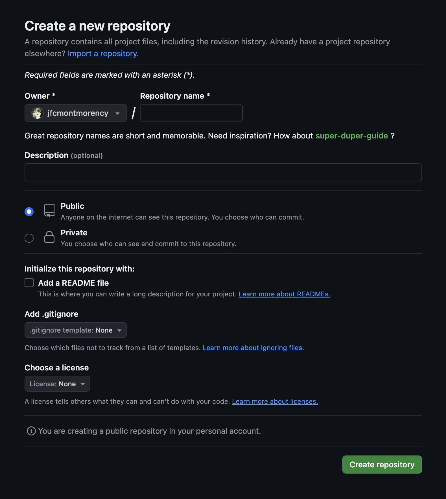
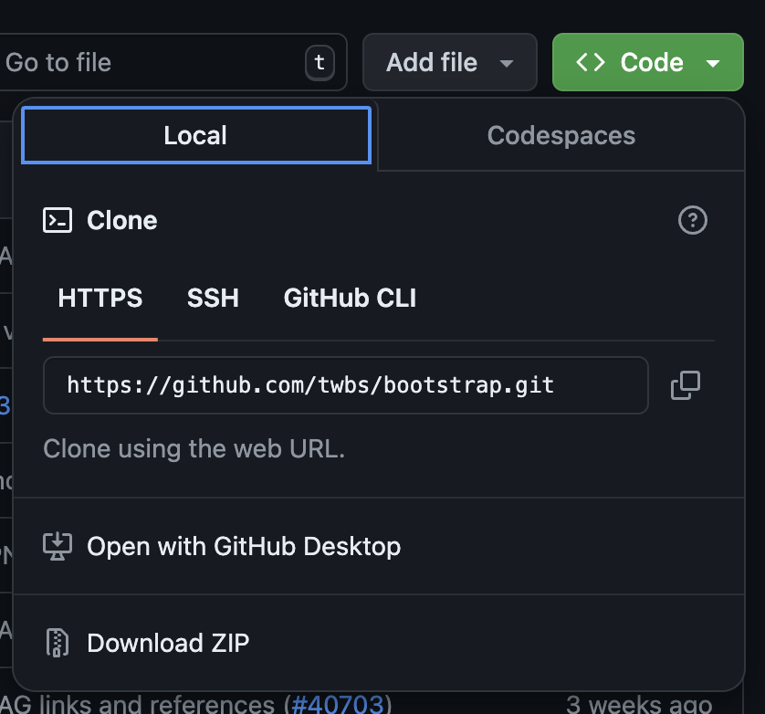

# Github


GitHub est un service en ligne qui permet de stocker et partager vos projets Git avec d’autres personnes.

Disons que c'est la partie concernée par la notion de `push` avec Git :wink:

## Collaboration

Héberger un projet sur GitHub est gratuit et beaucoup de projets sont publics afin de pouvoir être consultés/modifiés au besoin.

Parmi ces projets, on retrouve plusieurs librairies connues, telles que :

* [Bootstrap](https://github.com/twbs/bootstrap)
* [jQuery](https://github.com/jquery/jquery)
* [React](https://github.com/facebook/react)

On y retrouve également plusieurs organisations d'envergures :

* [NASA](https://github.com/nasa)
* [Microsoft](https://github.com/microsoft) Propriétaire de GitHub depuis 2018
* [Google](https://github.com/google)

## Création d'un répertoire

Pour créer un répertoire, il suffit d'être connecté à GitHub et de se rendre sur la page d'accueil. En haut à gauche de l'interface, un bouton `New` permet d'accéder à la page d'initialisation d'un nouveau repo.

{data-zoom-image}

### Nouveau répertoire

Sur cette page, il suffit d'entrer le nom désiré du repo, une brève description et son statut (privé ou public).

De plus, il est possible de spécifier si un fichier README devrait être créé, de spécifier si l'on souhaite utiliser un .gitignore et si une licence devrait être attribuée au projet.

{data-zoom-image}

## README

Le fichier README sert à présenter un projet. Il indique généralement la raison d'être du projet et souvent comment l'utiliser.

Sur GitHub, un fichier README situé à la racine d'un projet sera automatiquement détecté puis affiché sous les dossiers du projet en question.

C'est une porte d'entrée extrêmement importante dans un contexte de collaboration grand public.

Son contenu est traditionnellement rédigé en Markdown, d'où l'extension `.md`.

## Gitignore

Le fichier .gitignore permet de spécifier à Git des fichiers ou dossiers à l'intérieur du repo qu'il ne devrait pas surveiller et pousser vers le serveur (GitHub).

Voici un exemple de .gitignore :

```bash title=".gitignore"
node_modules/

.sass-cache/

mes-notes-perso.txt
```

## Licenses

Si un repo n'a aucune licence, il est possible d'utiliser son contenu librement.

Cependant, certaines licences vont spécifier:

* de créditer l'auteur
* que son usage est réservé aux projets à but non lucratif
* de ne pas modifier le contenu
* etc.

Voici un [petit guide](https://choosealicense.com/) (en anglais) pour vous aider à choisir une licence.

## Clone

Si vous avez créé votre repo en ligne, vous voudrez assurément travailler dessus sur un ordinateur, soit au collège ou à la maison.

Pour ce faire, il faut repérer le bouton vert `Code` en haut à droite de votre page de répertoire.

{data-zoom-image}

En cliquant sur celui-ci, vous aurez les options de:

Copier l'url du répertoire, ce qui peut-être requis par certains logiciels concurrents à GitHub Desktop.

{data-zoom-image}

Pour effectuer un clone en ligne de commande, vous pouvez utiliser l'url indiquée.

Pour cloner avec le logiciel « GitHub Desktop », assurez vous d'abord que celui-ci soit installé, puis cliquez sur le lien « Open with GitHub Desktop ».

## Fork

Pour modifier un repo en ligne, il faut en être l'auteur ou en avoir obtenu la permission.

Néanmoins, il est possible d'être intéressé par un projet et de vouloir s'en servir comme point de départ pour créer sa propre variation.

Pour ce faire, il est possible d'effectuer un `fork`. Cette commande copie le repo GitHub en question vers son compte GitHub. Puisque cette copie du repo vous appartient, vous pouvez effectuer des modifications et des `push` sur celle-ci.

Pour ce faire, il faut cliquer sur le bouton « Fork » en haut à droite du répertoire que l'on désire copier.

{data-zoom-image}

## Alternatives

Les deux plus grands compétiteurs à GitHub sont :

* Bitbucket :fontawesome-brands-bitbucket:
* GitLab :fontawesome-brands-gitlab: